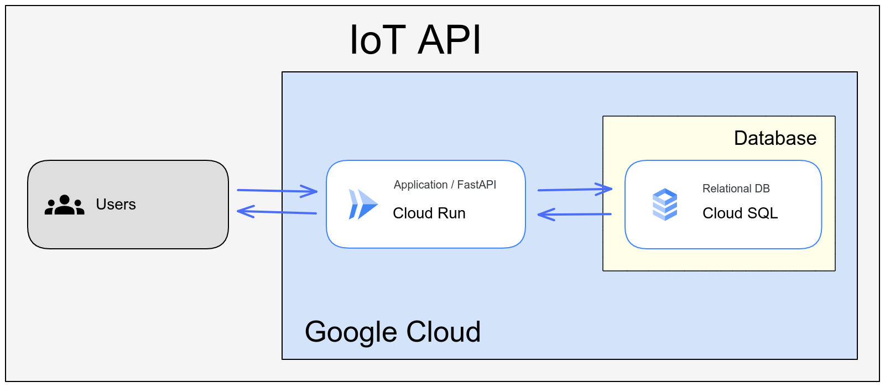
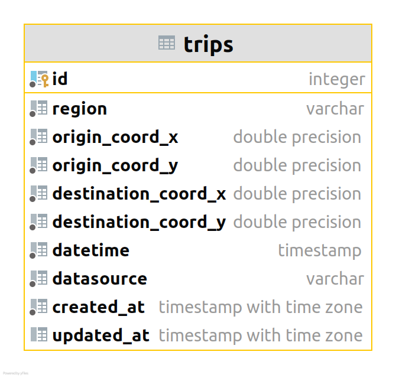

#  IoT API

This repository stores all the backend code for a proposed API to collect IoT devices' data. It is deployed through Cloud Run and uses a Cloud SQL instance (PostgreSQL) to store the information. You can see the full architecture diagram in the image below, created using Google Cloud Architecture Diagramming [tool](https://googlecloudcheatsheet.withgoogle.com/architecture):



Although the ER diagram is simple, you also can see it below:



## Local Development

1. Clone the project and `cd` inside directory:

```bash
git clone git@github.com:ewertones/iot-api.git
cd iot-api/
```

2. Build the image:

```bash
docker build -t iot:api .
```

3. Run the container:

```bash
docker run \
-e DB_HOST= \
-e DB_USERNAME= \
-e DB_DATABASE= \
-e DB_PASSWORD= \
-e DB_PORT= \
-p 8080:8080 \
iot:api
```

4. Access it through <http://localhost:8080>.

## Payloads

### /GET trips

```bash
curl --request GET 'localhost:8080/trips?skip=0&limit=10'
```

### /POST trip

```bash
curl --request POST 'localhost:8080/trip' \
--header 'Content-Type: application/json' \
--data-raw '{
  "region": "Prague",
  "origin_coord": "POINT (14.4973794438195 50.00136875782316)",
  "destination_coord": "POINT (14.43109483523328 50.04052930943246)",
  "date": "2018-05-28 09:03:40",
  "datasource": "funny_car"
}'

```

### /POST trips

```bash
curl --request POST 'localhost:8080/trips' \
--header 'Content-Type: application/json' \
--data-raw '[{
  "region": "Prague",
  "origin_coord": "POINT (14.4973794438195 50.00136875782316)",
  "destination_coord": "POINT (14.43109483523328 50.04052930943246)",
  "date": "2018-05-28 09:03:40",
  "datasource": "funny_car"
},
{
  "region": "Prague",
  "origin_coord": "POINT (14.4973794438195 50.00136875782316)",
  "destination_coord": "POINT (14.43109483523328 50.04052930943246)",
  "date": "2018-05-28 09:03:40",
  "datasource": "funny_car"
}]'
```
